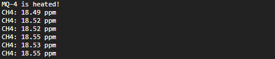

<div style = "font-family: 'Open Sans', sans-serif; font-size: 16px">

# ModuleAirAlcoholMQ3
<p align="center">
  
</p>

-----------------

# Лицензия
////

# Описание
<div style = "color: #555">

Модуль предназначен для работы с датчиком природного газа на базе нагревательного элемента [MQ-4](https://github.com/Konkery/ModuleAirMethaneMQ4/blob/main/res/MQ4_datasheet.pdf). Модуль является неотъемлемой частью фреймворка EcoLite. Датчик MQ-4 позволяет получить данные о концентрации метана в воздухе. Модуль работает по интерфейсу I2C. Модуль имеет следующие архитектурные решения фреймворка EcoLite:
- является потомком класса [ClassMiddleSensor](https://github.com/Konkery/ModuleSensorArchitecture/blob/main/README.md);
- использует шину через глобальный объект [I2Cbus](https://github.com/Konkery/ModuleBaseI2CBus/blob/main/README.md).
 
Количество каналов для снятия данных - 1.
</div>

### Конструктор
<div style = "color: #555">

Конструктор принимает один объект типа **SensorOptsType** и один объект типа [**SensorOptsType**](https://github.com/Konkery/ModuleSensorArchitecture/blob/main/README.md).
```js
let _sensor_props = {
    name: "MQ4",
    type: "sensor",
    channelNames: ['methane'],
    typeInSignal: "analog",
    typeOutSignal: "analog",
    quantityChannel: 1,
    busType: [ "i2c" ],
};
let _opts = {
    dataPin: A0,
    heatPin: P10,
    bus: i2c_bus,
    model: "MQ4",
    baseline: bl,
}
sensor = new ClassAirMethaneMQ4 (_opts, _sensor_props)
```
- <mark style="background-color: lightblue">dataPin</mark> - номер пина, по которому будут считываться данные с датчика;
- <mark style="background-color: lightblue">heatPin</mark> - номер пина, через который будет осуществляться контроль нагревателя датчика;
- <mark style="background-color: lightblue">bus</mark> - объект класса I2C, возвращаемый диспетчером I2C шин - [I2Cbus](https://github.com/Konkery/ModuleBaseI2CBus/blob/main/README.md);
- <mark style="background-color: lightblue">model</mark> - имя модели датчика из серии MQX, нужно для выбора правильного преобразования в базовом классе;
- <mark style="background-color: lightblue">baseline</mark> - норма концентрации паров спирта в помещении, где проводится измерение. Является корректирующей величиной;
</div>

### Поля
<div style = "color: #555">

- <mark style="background-color: lightblue">_Name</mark> - имя класса в строковом виде;
- <mark style="background-color: lightblue">_Sensor</mark> - объект базового класса;
- <mark style="background-color: lightblue">_MinPeriod</mark> - минимальная частота опроса датчика - 250 мс;
- <mark style="background-color: lightblue">_UsedChannels</mark> - используемые каналы данных по нотации архитектуры фреймворка EcoLite;
- <mark style="background-color: lightblue">_Interval</mark> - функция SetInterval для опроса датчика.
</div>

### Методы
<div style = "color: #555">

- <mark style="background-color: lightblue">Init(_sensor_props)</mark> - необходим для первоначальной настройки датчика;
- <mark style="background-color: lightblue">ControlHeater(_val)</mark> - контролирует нагрев датчика;
- <mark style="background-color: lightblue">Start(_num_channel, _period)</mark> - запускает циклический опрос заданного канала датчика. Переданное значение периода сверяется с минимальным значением хранящимся в поле *_minPeriod* и, если требуется, регулируется;
- <mark style="background-color: lightblue">ChangeFreq(_num_channel, _period)</mark> - останавливает опрос заданного канала и запускает его вновь с уже новой частотой;
- <mark style="background-color: lightblue">Stop(_num_channel)</mark> - прекращает считывание значений с заданного канала.
</div>

### Возвращаемые данные
<div style = "color: #555">


</div>


### Примеры
<div style = "color: #555">

Фрагмент кода для вывода данных о давлении и температуре в консоль раз в одну секунду. Предполагается, что все необходимые модули уже загружены в систему:
```js
//Подключение необходимых модулей
const ClassI2CBus = require("ClassBaseI2CBus.min.js");
const err = require("ModuleAppError.min.js");
const NumIs = require("ModuleAppMath.min.js");
     NumIs.is(); //добавить функцию проверки целочисленных чисел в Number

//Создание I2C шины
let I2Cbus = new ClassI2CBus();
let bus = I2Cbus.AddBus({sda: B9, scl: B8, bitrate: 400000}).IDbus;

//Настройка передаваемых объектов

```
Вывод данных в консоль:
<p align="left">
  
</p>
<div>

# Зависимости
- [ClassBaseI2CBus](https://github.com/Konkery/ModuleBaseI2CBus/blob/main/README.md)
- [ModuleAppError](https://github.com/Konkery/ModuleAppError/blob/main/README.md)
- [ModuleAppMath](https://github.com/Konkery/ModuleAppMath/blob/main/README.md)
</div>
